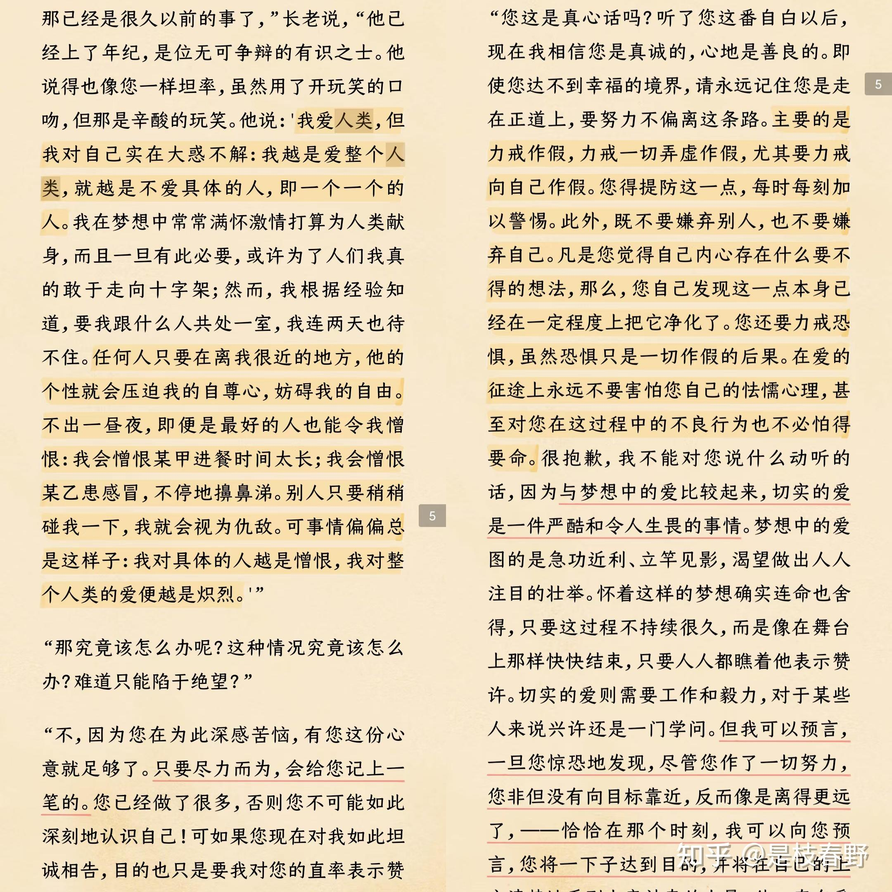

### *符号暴力之被锻造de审美*
- *我们的审美是被锻造的*
- *福科说只需要一个目光，一个凝视，被看者就会成为自身的监督者*
- *目光即是流动的权利，它并不作用于现实，而是作用于幻想*
- *这种无法被轻易感知到的审美替换，被植入到我们的意识中，他戴着天然的情感面具诱惑众生，好似一种自由生发的美丽追求，而被不假思索地接受*

所谓“美”和“对美的追求”，原本是来自“对生存的渴望和对死亡的排斥”吧，例如新鲜丰满的肉体、亮泽顺滑的毛发、灵动活泼的神情，都是代表着生机的，消费主义并不是让人产生了对“美”之概念本身对认知和“对美的追求”，但它确实有单一化、标准化对美的定义和怂恿人们为追求单一化、标准化甚至难以达到的美而不择手段的倾向。

### *想要幸福就去勾勒细枝末节*
- *人总是擅长描述鸿篇巨制的理想，但又终日惶惶于悲苦难熬现实，只是因为无法克服头脑中疯长的乏味*
- *在细微末节中勾勒出一个真实的世界*

年末了，朋友圈里又是春草般一片片的年度总结，说是记录，何不作日记，到底带着点分享的欲望和对关注的渴望。我当然不否定这一切，总结高光时刻、获得众人关注到底让人觉得度过的时光有点意义。我也翻看过去一年的照片试图说服自己没有虚度时光，但那些拍出能够发朋友圈的照片的瞬间之间的时光就没有意义了吗？

### *赛博同情中的权力意志 苦难成了精神快消品*
- *人是封闭在自我感受中的动物，同情的根基中，镶嵌着施予者的权力意志*
- *“啊他也太惨了吧，我还是比较幸福的”「在他人的苦难中寻找自身幸福的证据」*
- *亚当斯密认为，同情并非来自于同情本身，而是源自于自怜自爱*
- *这种布尔乔亚式的情感，遮蔽具体的视角，而沉溺于抽象的美德快感「不爱具体的人，爱抽象的人」「与亲近的人共情断裂」*
- *粉饰个人的道德恐慌*
- *赛博哭坟*
- *「人一旦做完精细的推理，充分表达了高尚的情感，就会悠闲地投入到他自己的追求和享受中，好像不曾发生过这些不幸的事，人的震惊和思索都是短暂的——亚当斯密《道德情操论》」*

一方面渴望他人的共情，一方面“不爱具体的人”，也是一种“双标”吧...
一开始觉得自己爱抽象的人胜过具体的人，而且似乎不只人，任何什么，情感、经历、思索，似乎抽象成文字就更吸引我似的。但仔细想了想又觉得并不完全理解“爱具体的人”和“爱抽象的人”之间的区别，比方我喜欢一个人（大概是比较抽象的情感），但见到其某件事做的不合我意（这里可能是具体的事件），但又因为“人都有缺点”（抽象的观念）而原谅此人，到底是抽象还是具体呢？于是上网搜索“具体的人”“抽象的人”，见到知乎有人提问罗翔这句话什么意思，又见到有人说罗翔引用了陀思妥耶夫斯基的话，再往下翻又见到有人说陀思妥耶夫斯基并没说过这话，是罗翔加上了自己的理解，而原话是

反而和我一开始的想法一样了... 但答主也归纳了对策：*对爱的行为而言，具体和抽象本就没有必要区分，重要的是爱的本质，而非爱的对象。爱具体，或是爱抽象，只要你的爱是真是诚，就已在路上，不偏不倚，不弄虚作假，不嫌弃他人，更不嫌弃自己，就已经十分难得。* 这倒是又有点像唯心主义那一派的说法了。