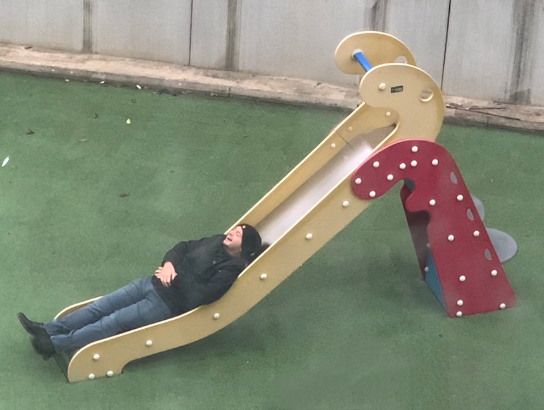

楼下有个小游乐场，就是那种居民区里给小孩子玩的地方，零散地建了几个摇摇木马，还有一架滑梯，它们刷着鲜艳明亮的红色、绿色、蓝色和黄色，如果是小时候的我，大概会觉得是个“超级哇塞的乐园”，就像姥姥家旁边的那个。

我在窗口坐着，正对那个地方，圣诞假期里，大部分时间只是枯叶纷飞，偶尔落着几只鸽子、乌鸦和喜鹊，也有时有老鼠跑过。

刚刚一些人走进来，我注意到的时候已经有一个男人坐在一个“多人用摇摇木马”（好生硬的名称但一时想不到更童趣的叫法...）上，很快他的一个同伴跑来坐在他对面，两个人挤在那个小小的器械上，我知道那种试图坐进去但can't really fit的感觉，因为我也心血来潮地试图玩过那个摇摇木马。

然后他又看到了滑梯，也许是感应到游乐场的魔法，他跑过去的时候蹦蹦跳跳的，他很快爬上去又滑下来，只可惜滑梯对他来说可能太小了，没能多享受一下“chuliu——”的乐趣。他躺在滑梯底笑了好一阵，我私心以为那多待的几秒，多少带着对不可复得的童年的怀念。

