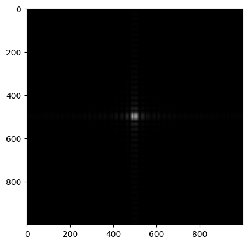
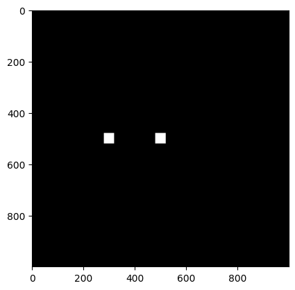

## C'est comment le filtre ?
Pour identifier ce filtre, j'ai utilisé comme le donné un dirac au centre d'une figure de $1000\times 1000$, avec $sampling\space step = 1e-09$, et j'ai obtenu le résultat suivant:

Si on zoom, on voit:

où l'enveloppe est la diffraction d'un carré, mais il est multiplié par des franges qui semblent à la fente de Young.

Si c'était le cas, l'ouverture est la convolution entre un carré et deux point, qui donne deux carrés.

On fait un transformé de Fourier inverse pour vérifier cette hypothèse, qui donne:

on a bien deviné :3

On observe aussi qu'ils ne sont pas au centre, ce qui donne un déphasage invisible en densité.

## La taille des carrés
D'après le cours, on peut calculer la longeur du coté d'un carré par $$\frac{2\lambda}{n\theta}$$, avec $\lambda$ = longeur d'onde de la lumière, $n$ = nombre de pixel de la diffraction et $\theta$ = sampling step, alors ici on a $25m$.

## La position des carrés
Les franges sont verticaux alors les carrés sont positionnés horizontalement, et leurs centres sont séparés de $333m$.

Je sais pas trop comment traiter le déphasage, mais on voit dans le ift qu'un carré et au centre et l'autre est décalé de lui d'une distance de $333m$ horizontalement...

