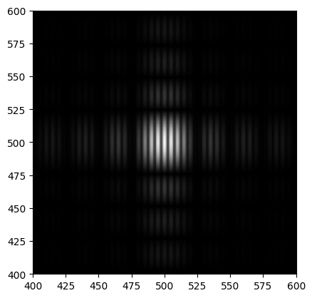

## C'est comment le filtre ?
Pour identifier ce filtre, j'ai utilisé comme la donné un dirac au centre d'une figure de \\(1000\times 1000\\), avec \\(sampling\space step = 1\cdot 10^{-9}\\), et j'ai obtenu le résultat suivant:

Si on zoom, on voit:

où l'enveloppe est la diffraction d'un carré, mais il est multiplié par des franges qui semblent à la fente de Young.

Si c'est le cas, l'ouverture sera la convolution entre un carré et deux points, ce qui donne deux carrés.

On fait un transformé de Fourier inverse pour vérifier cette hypothèse, il donne:

on a bien deviné :3

On observe aussi que les carrés ne sont pas au centre, ce qui donne un déphasage invisible en densité.

## La taille des carrés
D'après le cours, on peut calculer la longeur du coté d'un carré par \\[\frac{2\lambda}{n\theta}\\]

avec 

\\(\lambda \\) = longeur d'onde de la lumière = \\(0.5 \cdot 10^{-6}m\\), 

\\(n\\) = nombre de pixel de la diffraction = \\(40\\),

\\(\theta\\) = sampling step = \\(1\cdot 10^{-9}\\),

\\[A.N. \space \frac{2 \cdot 0.5 \cdot 10^{-6}}{40\cdot 1\cdot 10^{-9}} = 25m\\]

alors la longeur du coté d'un carré est \\(25m\\).

## La position des carrés
Les franges sont verticales alors les carrés sont positionnés horizontalement, et leurs centres sont séparés de \\(333m\\). Ceci est calculé de la même manière que la longeur du coté d'un carré, avec \\(n\\) = \\(3\\).

Je ne sais pas trop comment traiter le déphasage, mais on voit dans le ift qu'un carré et au centre et l'autre est décalé de lui d'une distance de \\(333m\\) horizontalement..

